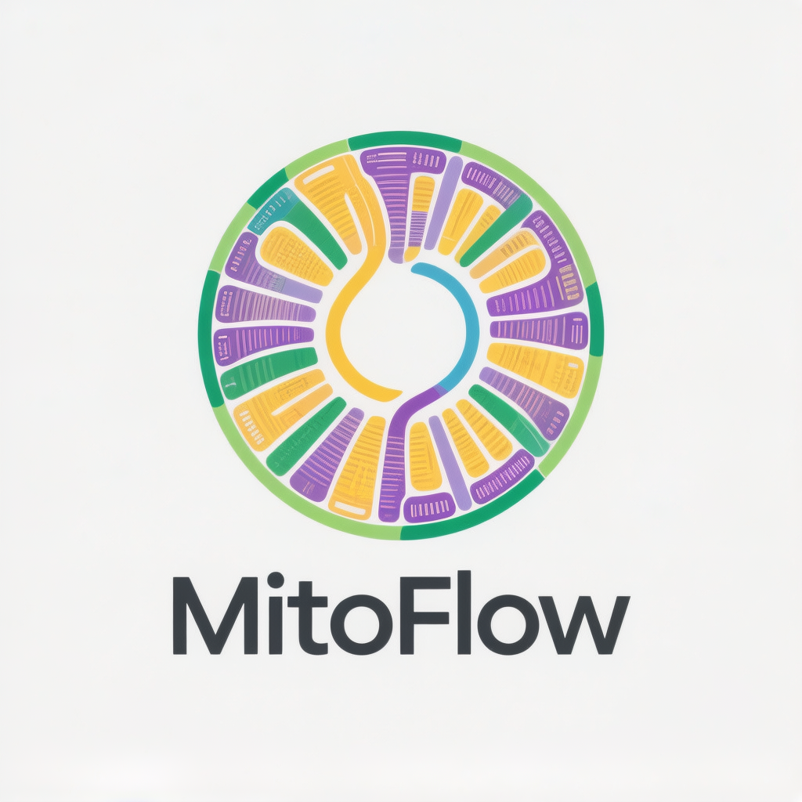

<p align="center">
  
</p>

<p align="center">
  中文 | <a href="README.md">English</a>
</p>

<p align="center">
  <em>一条命令，一篇论文。</em>
</p>

---

**MitoFlow** 是一个基于 Python 3.10+ 的植物线粒体基因组注释与比较分析平台。从原始 FASTA 到发表级输出——注释、密码子使用、选择压力、核苷酸多样性、共线性、系统发育——统一 CLI 一键完成。

## 功能特色

- **自动化注释** — 蛋白编码基因（pyhmmer HMM + BLAST）、tRNA（tRNAscan-SE + ARAGORN）、rRNA（Barrnap），支持边界校正和 RNA 编辑
- **密码子使用分析** — RSCU、ENC、GC3s、GC12、PR2 偏倚图、中性绘图、ENC-GC3s 选择绘图（7 张发表级图表）
- **Ka/Ks 选择压力** — 双引擎：KaKs_Calculator-3.0（C++，7 种方法）+ Python NG86 兜底；柱状图、点图、散点图、箱线图、饼图
- **核苷酸多样性 (Pi)** — CDS 与 IGS 区域 Pi 计算、进化热点识别、排序柱状图
- **共线性可视化** — 基于 gbdraw 的线性图，配对 tblastx 比对链接
- **基因组图谱** — R（OGDrawR）或 Python（gbdraw）环形基因组图；50+ 配色方案
- **多构型结构** — 重复序列介导的重组预测
- **CMS 候选基因** — 新 ORF 扫描、嵌合基因检测、跨膜结构域预测
- **MTPT 检测** — 叶绿体来源片段识别与点阵图
- **系统发育流程** — 共有基因提取、MAFFT 比对、trimAl 修剪、超矩阵拼接

## 快速开始

### 安装

```bash
# 核心包
pip install mitoflow

# 含 gbdraw 可视化支持
pip install "mitoflow[viz-gbdraw]"

# 外部工具（可选但推荐）
conda install -c bioconda trnascan-se aragorn barrnap blast mafft trimal iqtree
```

### 注释线粒体基因组

```bash
mitoflow annotate \
  -i mitogenome.fasta \
  -o results/ \
  --name "Arabidopsis thaliana" \
  --cp chloroplast.fasta
```

运行完整 10 步流程：加载、PCG 注释、tRNA/rRNA 注释、边界校正、CDS 验证、GFF3 + GenBank 输出、序列提取、质控、MTPT 检测。

### 下游分析

```bash
# 密码子使用（RSCU、ENC、PR2、中性绘图）
mitoflow codon -i annotation.gbk -o codon_results/

# Ka/Ks 选择压力（自动检测 KaKs_Calculator-3.0）
mitoflow kaks -q query.gbk -r ref1.gbk -r ref2.gbk -o kaks_results/

# 跨物种核苷酸多样性
mitoflow pi -i sp1.gbk -i sp2.gbk -o pi_results/

# 共线性 + gbdraw 可视化
mitoflow synteny -i sp1.gbk -i sp2.gbk -o synteny_results/ --viz gbdraw

# 基因组图谱（有 R 则用 OGDrawR，否则用 gbdraw）
mitoflow viz -i annotation.gbk -o genome_map.png --style gbdraw --palette orchid
```

## 输出结构

```
results/
├── gff/                       # GFF3 注释
├── genbank/                   # GenBank 格式（可直接提交 NCBI）
├── fasta/                     # CDS、Protein、tRNA、rRNA、Gene、Intron
└── report/                    # 质控评分、MTPT 报告、基因组图谱
```

每个下游模块仅创建实际需要的目录（惰性创建）。

## 可视化后端

| 后端 | 语言 | 风格 | 安装 |
|------|------|------|------|
| **OGDrawR** | R | OGDraw 风格环形图 | `Rscript -e "remotes::install_github('xibeixingchen/OGDrawR')"` |
| **gbdraw** | Python | 发表级 SVG/PNG，50+ 配色 | `pip install gbdraw cairosvg` |

报告优先使用 OGDrawR（R），不可用时回退 gbdraw（Python）。

## CLI 命令

| 命令 | 说明 |
|------|------|
| `annotate` | 完整注释流程 |
| `qc` | 五维质量控制（0–100 评分） |
| `mtpt` | 线粒体叶绿体来源 DNA 检测 |
| `codon` | 密码子使用分析（7 张图） |
| `kaks` | Ka/Ks 选择压力（双引擎） |
| `pi` | 核苷酸多样性与热点检测 |
| `synteny` | 共线性分析与可视化 |
| `phylo` | 系统发育比对准备 |
| `cms` | CMS 候选基因预测 |
| `viz` | 基因组图谱生成 |
| `report` | HTML 报告生成 |

## 内置参考数据库

- **46 个 HMM 谱** — 蛋白编码基因（多物种 MAFFT 比对构建）
- **46 个蛋白参考 FASTA** — BLAST 兜底
- **323 个基因产物** — 标准化命名
- **782 个基因别名** — 跨工具兼容
- **23 个已知 CMS 基因** — 来自 15+ 植物物种

## 引用

如在研究中使用 MitoFlow，请引用：

```
MitoFlow: A modern plant mitochondrial genome annotation and analysis platform.
```

## 许可证

[MIT](LICENSE)
